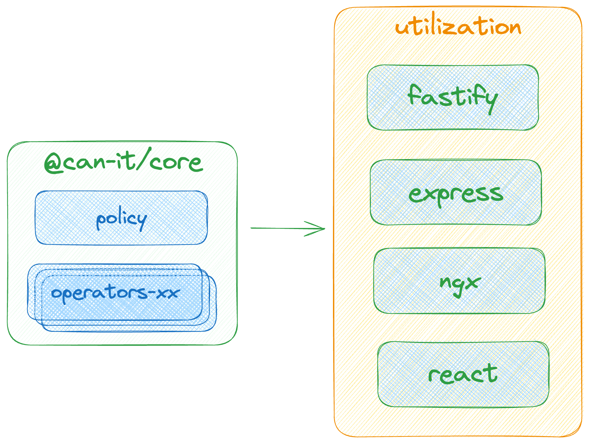

# CanIt

We're excited to share that CanIt supports a variety of packages to enhance your experience. Here are the core packages and utilities currently available:

  

## Core Packages
- **[@can-it/core](https://www.npmjs.com/package/@can-it/core):** This is the core package that forms the foundation of CanIt. [Documentation](./packages/core/)

#### Operators
- **[@can-it/operators-exact](https://www.npmjs.com/package/@can-it/operators-exact):** Provides an exact matching comparator. [Documentation](./packages/operators/exact/)
- **[@can-it/operators-relation](https://www.npmjs.com/package/@can-it/operators-relation):** Provides an relation matching comparator and its generator. [Documentation](./packages/operators/relation/)
- **[@can-it/operators-nested](https://www.npmjs.com/package/@can-it/operators-nested):** Enables a nested structure matching comparator. [Documentation](./packages/operators/nested/)

## Utilization Packages
- **[@can-it/ngx](https://www.npmjs.com/package/@can-it/ngx):** Integration package for Angular applications. [Documentation](./packages/ngx/)
- **[@can-it/react](https://www.npmjs.com/package/@can-it/react):** Integration package for React applications. [Documentation](./packages/react)
- **@can-it/express**: Integration package for Express applications. (💪 *Comming soon* ⏰)
- **@can-it/fastify**: Integration package for Fastify applications. (💪 *Comming soon* ⏰)

🚀🚀🚀 **Coming Soon: Full Documentation** 🚀🚀🚀

📚 📚 More detailed documentation, including usage guides, examples, and advanced features, is currently in progress. We appreciate your patience and encourage you to check back soon for a comprehensive resource to help you make the most out of CanIt. Stay tuned!
