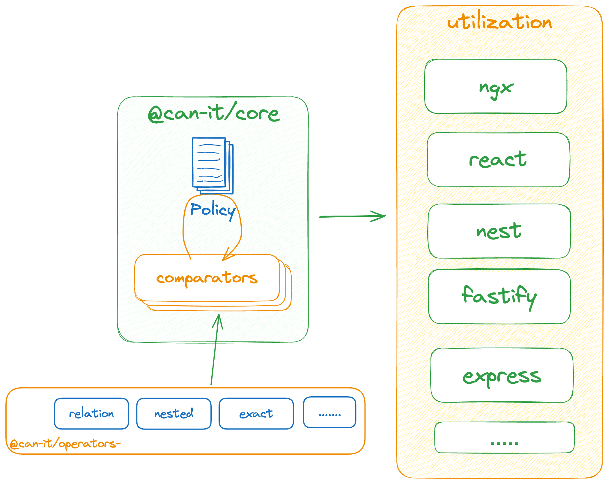

# CanIt

🚀🚀🚀 **Coming Soon: Full Documentation** 🚀🚀🚀

We're excited to share that CanIt supports a variety of packages to enhance your experience. Here are the core packages and utilities currently available:

## Core Packages
- **[@can-it/core](https://www.npmjs.com/package/@can-it/core):** This is the core package that forms the foundation of CanIt.

#### Operators
- **[@can-it/operators-exact](https://www.npmjs.com/package/@can-it/operators-exact):** Provides exact matching comparator.
- **[@can-it/operators-relation](https://www.npmjs.com/package/@can-it/operators-relation):** Provides exact matching comparator and its generator.
- **[@can-it/operators-nested](https://www.npmjs.com/package/@can-it/operators-nested):** Enables nested structure matching comparator.

## Utilization Packages
- **[@can-it/ngx](https://www.npmjs.com/package/@can-it/ngx):** Integration package for Angular applications.
- **[@can-it/react](https://www.npmjs.com/package/@can-it/react):** Integration package for React applications.

📚 More detailed documentation, including usage guides, examples, and advanced features, is currently in the works. We appreciate your patience and encourage you to check back soon for a comprehensive resource to help you make the most out of CanIt. Stay tuned!
