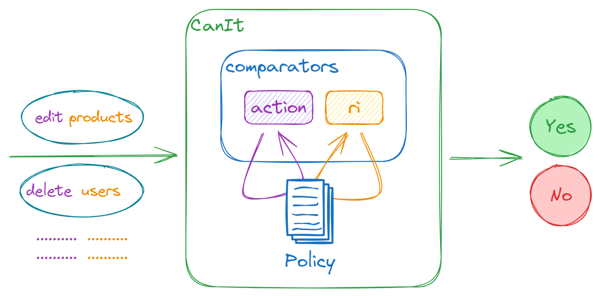

# @can-it/core

`@can-it/core` provides functionality for handling access control and permission checks based on actions and resource identification.
[](https://www.npmjs.org/package/@can-it/core)

<div style="width: 100%; display: flex; justify-content: center;">
  
</div>

## Installation

You can install the library using npm. Run the following command in your project directory:

```shell
npm install @can-it/core
```

## Concepts

- **Resource Identity** (also known as `RI`) represents a specific value for each resource in your system. Examples of RIs are:
  - `organizations`
  - `organizations::f47ac10b-58cc::users::00c04fd430c8`
  - `organizations::f47ac10b-58cc::products::7740a5e3c5e1`
  - `organizations::f47ac10b-58cc::products`
  - `organizations::*::users`

- **Action** represents the actions used in the authorization process of your system.

- **Permission** is an array with two strings that contain the **Action** and **RI** in order. For example, a permission that allows creating a new post can be presented as `['create', 'posts']`.

- **Policy** is a list of **Permission**s defined for a principal, typically representing the currently authenticated user.

- **Comparator** is an interface that has `isAllowed` and `isDenied` methods used to check whether the request action/RI matches a specific permission action/RI defined in the PolicyState object. The package currently supports comparing two values for equality. It performs a simple string comparison to check if two values are exactly the same. You can replace it with other [can-it comparators](https://www.npmjs.com/search?q=keywords:can-it-operators) or implement it yourself by implementing the `Comparator` interface from the [@can-it/types](https://www.npmjs.org/package/@can-it/types) package.

## Usage

Using this package is easy. Follow the example below to get started:

```typescript
// Import classes from the library
import { CanIt } from '@can-it/core';
import { ExactComparator } from '@can-it/operators-exact';

// Create a CanIt instance by providing:
// - Policy
// - Action Comparator
// - Ri Comparator
const canIt = new CanIt(
  {
    allow: [
      ['create', 'posts'],
      ['delete', 'posts']
    ],
    deny: [
      ['delete', 'users']
    ]
  },
  new ExactComparator(), // You can leave it as undefined; it will use the ExactComparator as the default.
  new ExactComparator() // You can leave it as undefined; it will use the ExactComparator as the default.
);

// Check whether a request is allowed or not
console.log(
  canIt.allowTo('create', 'posts')
);
// Output: true

console.log(
  canIt.allowTo('delete', 'users')
);
// Output: false
```

## License

This project is licensed under the [MIT License](/LICENSE).
