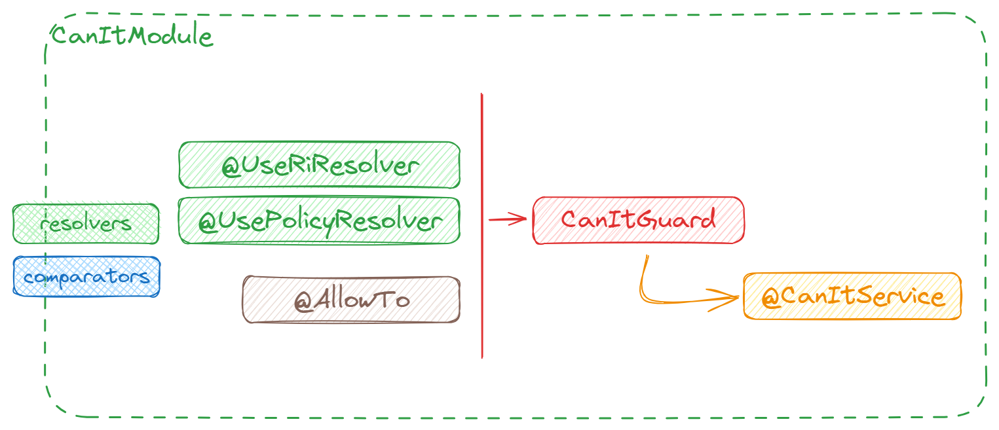

# @can-it/nest

The `@can-it/nest` library is a Nest (Nestjs) library that provides an easy and efficient way to implement authorization in your application. With this package, you can quickly integrate complex authorization scenarios into your app in just a few minutes.

<div style="width: 100%; display: flex; justify-content: center;">
  
</div>

## Installation

To install this package, you can use npm, yarn, or pnpm. Run one of the following commands in your project directory:

```shell
npm install @can-it/nest
```

```shell
yarn add @can-it/nest
```

```shell
pnpm add @can-it/nest
```

## Usage

- `CanItGuard`: Like other guards in Nest, you can use this guard directly at the controller or handler scope. Eventually, you can use it at the global scope by declaring it as a provider in the AppModule.

  ```typescript
  @Module({
    // ...
    providers: [
      // ...
      {
        provide: APP_GUARD,
        useClass: CanItGuard
      }
      // ...
    ]
  })
  export class AppModule {}
  ```

- `@UsePolicyResolver` decorator: You need to pass a PolicyResolver function to this decorator, which contains the logic for loading the policy for the current execution request (usually the policy of the current user).

  > **💡 Recommended:** It is recommended to configure the policy resolver at the module scope using the `CanItModule.configure` method. For other specific use cases, you can define the Policy Resolver at the controller or handler scope.

  ```typescript
    @Delete(':id')
    @UsePolicyResolver(
      (context: ExecutionContext, thisModule: ModuleRef): PolicyState => {

        return {
          allow: req.params['actor'] === 'ADMIN' ? [['delete', 'POLICIES']] : []
        };
      }
    )
    delete() {
      // your handler logic here
    }
  ```

- `@AllowTo` decorator: This decorator is used to specify the permission needed to access a specific controller or handler.

  ```typescript
    @Controller('cats')
    @AllowTo('view', 'cats')
    export class CatsController {
      constructor(
        private catsService: CatsService
      ) {}

      // This handler will still be applied the guard with the permission that was defined from the controller @AllowTo above
      @Get()
      get() {
        return this.catsService.getAll();
      }

      @Delete(':id')
      @AllowTo('delete', 'cats')
      delete(@Param('id') id: string) {
        return this.catsService.delete(id);
      }
    }
  ```

- `@UseRiResolver` decorator: This decorator helps you generate dynamic RI (Resource Identity) based on the ExecutionContext object for that request.

  > **👉Important:** You can also configure the RI (Resource Identity) resolver at the module scope using the `CanItModule.configure` method.

  ```typescript
    // ...

    @Get(':id')
    @AllowTo('view')
    // The use of @UseRiResolver below will return "cats" as the resource identity
    // The returned value will be combined with the "view" action provided from @AllowTo above
    @UseRiResolver(
      (context: ExecutionContext, thisModule: ModuleRef) => {
        return 'cats';
      }
    )
    getOne(@Param('id') id: string) {
      // your handler logic here
    }

    // ...
  ```

- `@CanItService` decorator: This decorator helps you get the CanIt instance, which is used to check a request directly in your handler logic.

  ```typescript
    // ...

    @Get()
    @AllowTo('view', 'cats')
    getOne(@CanItService() canIt: CanIt) {
      // ...
      const canEditCats = canIt.allowTo('edit', 'cats')
      // ...
    }

    // ...
  ```

- `CanItModule.configure`: This method is used to set the comparators and resolvers that will be used by the CanItGuard. You can provide them in any Nest module you want.

  - Comparators: Both the RI (Resource Identity) and action comparators will use the [@can-it/operators-exact](./packages/operators/exact/) package by default, which provides an exact matching comparator. However, you can also use other comparators available [here](https://www.npmjs.com/search?q=keywords:can-it-operators) by passing them to the `comparators` attribute as shown below.
  - Resolvers: These help you provide RiResolver and PolicyResolver at the module scope, avoiding the repetition of logic in every controller or handler if possible.

  ```typescript
  // ...

  const canItConfiguration: CanItConfiguration = {
    comparators: {
      action: new RelationComparator(
        ['view', 'edit', 'delete'],
        { edit: ['view'] }
      )
    },
    resolvers: {
      ri: (context: ExecutionContext) => {
        const req = context.switchToHttp().getRequest();
        return req.params.id || req.path.replace(/\/$/, '').split('/').pop();
      },
      policy: (_context: ExecutionContext, thisModule: ModuleRef) => {
        const policyService = thisModule.get(PolicyService, { strict: false });
        return policyService.get();
      }
    }
  };

  @Module({
    // ...
    providers: [
      // ...
      CanItModule.configure(canItConfiguration)
    ],
    // ...
  })
  export class AppModule {}

  ```

For more details, you can refer to [the example here](https://github.com/can-it/examples/blob/main/apps/nest/src/main.ts).
