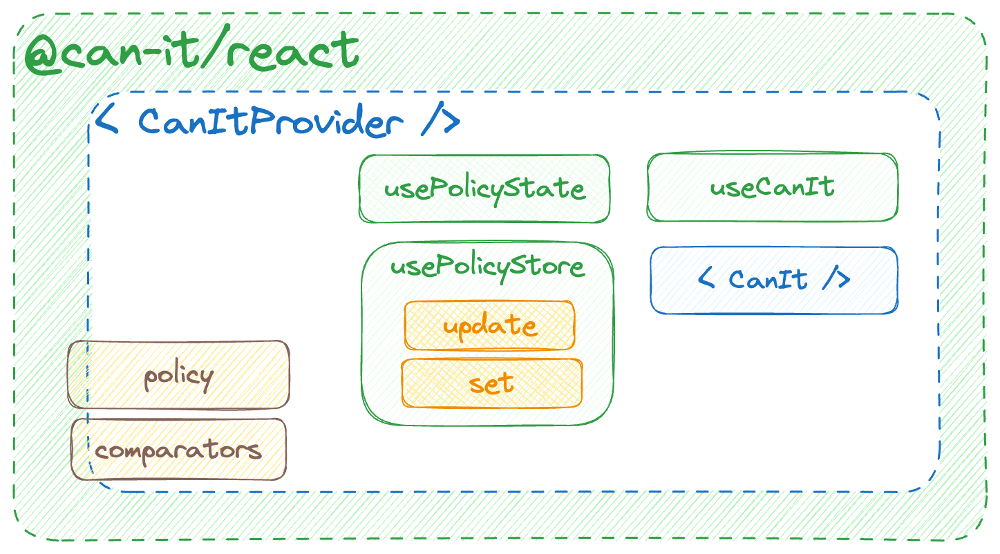

# @can-it/react

`@can-it/react` is a React library designed to simplify the implementation of authorization in your application. The library provides a straightforward way to integrate complex authorization scenarios into your app within minutes using the `CanItProvider`.
[](https://www.npmjs.org/package/@can-it/react)

<div style="width: 100%; display: flex; justify-content: center;">
  
</div>

### Examples
[👉 Source code](https://github.com/can-it/examples/tree/main/apps/react)

## Features

- **Simplified Authorization Implementation:** `CanItProvider` makes it easy to add authorization functionality to your React app.

- **Support for Nested Authorization Scenarios:** The library accommodates nested authorization scenarios, making it ideal for applications with multiple authorization contexts.

## Installation

To install `@can-it/react`, you can use npm, yarn, or pnpm. Run one of the following commands in your project directory:

```shell
npm install @can-it/react
```

```shell
yarn add @can-it/react
```

```shell
pnpm add @can-it/react
```

## Usage

1. Import the `CanItProvider` into your React application's component:

    ```tsx
    import { CanItProvider } from '@can-it/react';

    export function HomeComponent() {
      return (
        <CanItProvider
          comparators={{ ri: new ExactComparator(), action: new ExactComparator() }}
          {/* You can pass it later by using the usePolicyStore hook */}
          policy={{ allow: [['edit', 'cats']] }}>

          <ProductComponent />
        </CanItProvider>
      );
    }
    ```

    - By default, the `CanItProvider` will use the compare action and RI in an exact way. If you want to compare it in another way, you can pass it via `CanItProviderProps` `comparators`. You can replace it with our [other can-it-operators here](https://www.npmjs.com/search?q=keywords:can-it-operators).
    - You also passed the policy state in its props, but it's not required. You can pass it later by using the `usePolicyStore` hook, which is mentioned below.

Then:

- Use the `CanIt` component to choose to display allowed content or not.

    ```tsx
    // product-component.tsx
    import { CanIt } from '@can-it/react';

    export function ProductComponent() {

      return (<CanIt allowTo={['view', 'products']} else="You cannot view the products">
        You can view products { canEditProducts && 'and edit products also' }.
      </CanIt>);
    }
    ```

- Use the `useCanIt` hook to check whether a specific request can be performed directly in your component.

    ```tsx
    // product-component.tsx
    import { useCanIt } from '@can-it/react';

    export function ProductComponent() {
      // using the hook to check whether a specific action can be performed
      const canEditProducts = useCanIt('edit', 'products');

      return canEditProducts ? <>You can edit products</> : <>You can not edit products</>
    }
    ```

- And you can use `usePolicyStore` to update the policy in your component.

    ```tsx
    // product-component.tsx
    import { usePolicyStore } from '@can-it/react';

    export function ProductComponent() {
      const { update, set } = usePolicyStore();

      useEffect(() => {
        set({ allow: [['view', 'products']] });

        // update the policy state after 3 seconds
        setTimeout(() => {
          update(prePolicy => {
            prePolicy.allow.push(['edit', 'products']);

            return prePolicy;
          });
        }, 3000);
      }, []);


      // using the component
      return <CanIt allowTo={['edit', 'products']} else="You cannot edit products">You can edit products</CanIt>;
    }
    ```

- You can also use `usePolicyState` to retrieve the current policy.

    ```tsx
    // product-component.tsx
    import { usePolicyState } from '@can-it/react';

    export function ProductComponent() {
      const { policy } = usePolicyState();

      return (<CanIt allowTo={['view', 'products']} else="You cannot view the component">
        You can view products with the current policy {JSON.stringify(policy, null, '  ')}
      </CanIt>);
    }
    ```
